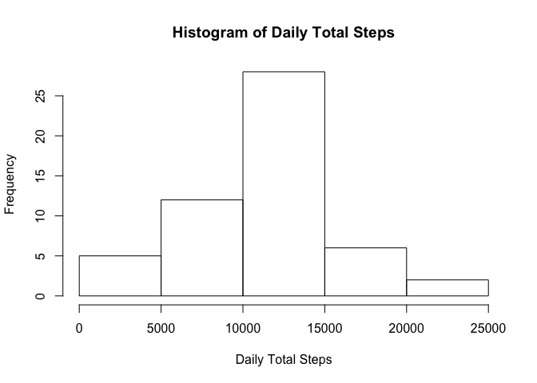
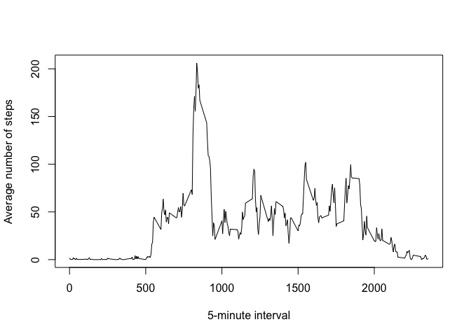
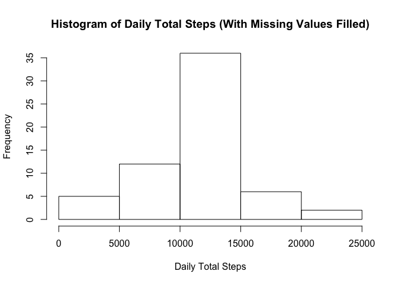
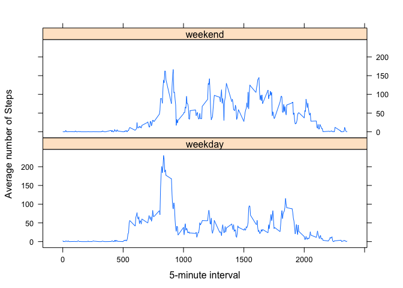

# Reproducible Research: Peer Assessment 1


```r
## Loading and preprocessing the data

## Read the csv
activityWithNA <- read.csv("activity.csv")
## Remove NA from the data
activity <- activityWithNA[complete.cases(activityWithNA),]


## What is mean total number of steps taken per day?

## Aggregate by date
activityByDay <- aggregate(list(steps=activity$steps), by = list(date=activity$date), FUN = sum)
## Histogram of total number of steps taken each day
hist(activityByDay$steps, xlab = "Daily Total Steps", main = "Histogram of Daily Total Steps")
```



```r
## Calculate the mean steps per day
meanStepsPerDay <- as.integer(mean(activityByDay$steps))
## Calculate the mean steps per day
medianStepsPerDay <- as.integer(median(activityByDay$steps))
```

Mean steps per day = 10766

Median steps per day = 10765


```r
## What is the average daily activity pattern?

## Calculate mean steps per interval across all days
activityByTimeInterval <- (aggregate(list(meansteps=activity$steps), by = list(interval=activity$interval), FUN = mean))
maxMeanSteps = max(activityByTimeInterval$meansteps)
maxInterval = activityByTimeInterval$interval[which(activityByTimeInterval$meansteps==maxMeanSteps)]


## Plot interval (x) by average steps per interval across all days (y)
plot(activityByTimeInterval, type = "l", xlab = "5-minute interval", ylab = "Average number of steps")
```



5-minute interval with maximum steps (on average): 835


```r
## Imputing missing values

## Total number of missing values
totalMissingValues <- sum(is.na(activityWithNA$steps))
```

Total number of missing values = 2304


```r
## Fill in the missing values with the mean value for that interval
activityFilledNA <- merge(activityWithNA, activityByTimeInterval)
activityFilledNA[which(is.na(activityFilledNA$steps)),"steps"] <- activityFilledNA[which(is.na(activityFilledNA$steps)),"meansteps"]
activityFilledNA$meansteps <- NULL


activityFilledNAByDay <- aggregate(list(steps=activityFilledNA$steps), by = list(date=activityFilledNA$date), FUN = sum)
meanStepsPerDayFilledNA <- as.integer(mean(activityFilledNAByDay$steps))
medianStepsPerDayFilledNA <- as.integer(median(activityFilledNAByDay$steps))
hist(activityFilledNAByDay$steps, xlab = "Daily Total Steps", main = "Histogram of Daily Total Steps (With Missing Values Filled)")
```



Mean steps per day (missing values filled) = 10766

Median steps per day (missing values filled) = 10766


```r
## Are there differences in activity patterns between weekdays and weekends?
activityFilledNA$weekday <- sapply(weekdays(as.Date(activityFilledNA$date), TRUE), function(x){if (x %in% c("Mon", "Tue", "Wed", "Thu", "Fri")) as.factor("weekday") else as.factor("weekend")})

## Calculate mean steps per interval across all days
activityFilledNAByTimeInterval <- (aggregate(list(meansteps=activityFilledNA$steps), by = list(interval=activityFilledNA$interval, weekday=activityFilledNA$weekday), FUN = mean))

library(lattice)
xyplot(meansteps~interval|weekday, data = activityFilledNAByTimeInterval, ylab="Average number of Steps", xlab="5-minute interval", layout=c(1,2), type="l")
```


